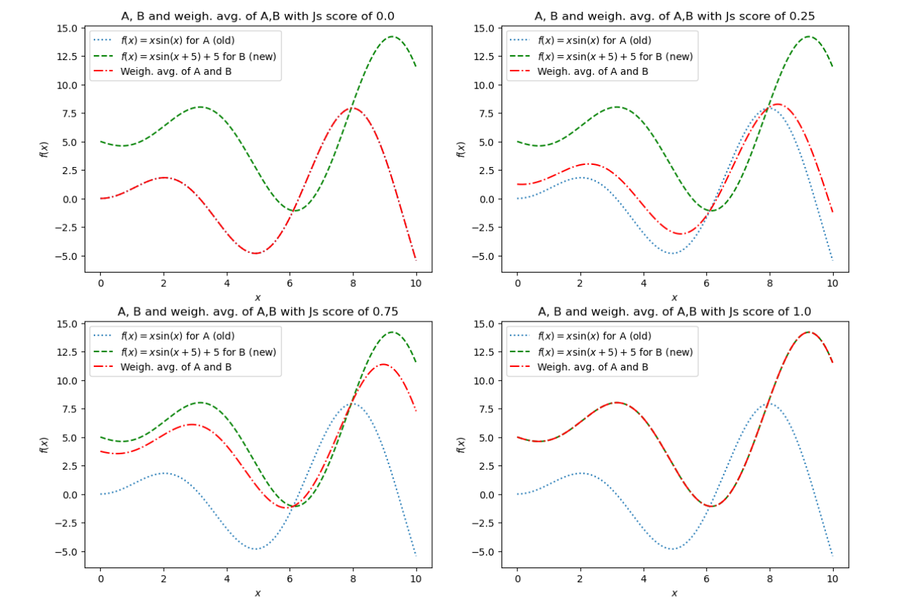

# warwick_public
A selection of academic projects from my BSc in Computer Science at the University of Warwick.

## BSc Thesis

### Tweet: Turbo charged database performance with Machine Learning

- **Please open:**
    - [Final presentation](https://github.com/ValentinK214/warwick_public/blob/main/thesis/presentation_final_submission.pdf) for an initial overview
    - [Thesis submission](https://github.com/ValentinK214/warwick_public/blob/main/thesis/thesis_final_submission.pdf) for the actual 97 page report titled **OLTP workload mapping for database tuning**

- **Abstract:**
    - > This dissertation aims to reduce the sampling bottleneck in the context of OLTP database tuning. Since the inception of the database tuning research landscape in the 1970s, there have been numerous approaches to achieve faster overall database performance. The latest research efforts rely mostly on machine learning-based tuning agents which require exhaustive sampling and offline training before they can be deployed. As such, there exists an incentive to reduce the sampling time to allow for a faster end-to-end tuning process. To this end, a novel similarity score, sampling function, and ensemble model have been developed for this dissertation. The rationale behind each design choice will be elucidated before proceeding to experimentally determine the effectiveness of the proposed solutions. In the end, the ideas presented in this dissertation were able to significantly reduce the sampling bottleneck whilst still returning competitive database settings.

- **Achievements:**
    - 25% speed improvement in only 1/3rd of the time it usually takes to tune the database
    - Proof of concept established by the novel ensemble model and innovative use of the Jensen-Shannon divergence score
    - Graded as a **First class** thesis project by 2 independent academic supervisors from the University of Warwick (ranked 4th in the U.K. for Computer Science, after Oxford, Cambrdige and Imperial)

- **Key Learnings:**
    - Keep project scope flexible for unexpected results
    - Balance report writing with coding/experimentation
    - Regularly discuss progress with supervisors and peers for schedule adherence
